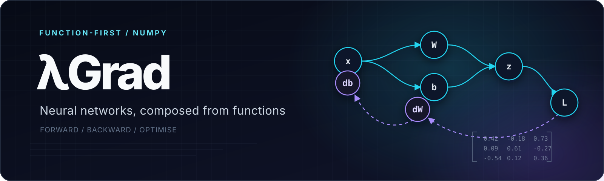
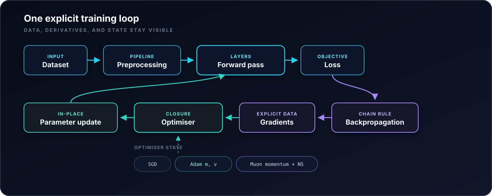

<p align="center">
  
</p>

<p align="center">
  
  
  
  
</p>

# LambdaGrad

LambdaGrad is a function-first neural-network engine built from scratch in Python and NumPy. It makes the complete training process explicit, from forward propagation and numerically stable backpropagation to closure-backed SGD, Adam, and Muon optimisers.

The project explores how neural-network systems can be organised around functions, composition, and transparent state instead of behaviour-heavy class hierarchies. NumPy provides the numerical primitives; layer execution, gradient calculation, optimisation, callbacks, and training orchestration are implemented directly.

<p align="center">
  <strong>Core engine</strong><br /><br />
  
  &nbsp;&nbsp;&nbsp;
  
</p>

## Why LambdaGrad?

- **Transparent gradient path.** Dense affine transforms, activation caches, reverse traversal, and parameter gradients are visible in the source. A combined BCE-sigmoid output derivative computes `dL/dz` directly, avoiding the unstable composition of separate derivatives near probability boundaries.
- **Modern optimiser mechanics.** SGD, Adam, and a Muon-style update share the same callable interface. Adam retains moments in a closure; Muon accumulates momentum and applies Newton-Schulz orthogonalisation to two-dimensional weight updates.
- **Functions over behaviour-heavy objects.** Dataclasses hold layers, models, gradients, history, and callback state. Free functions create, evaluate, differentiate, optimise, and train them.

## Architecture

<p align="center">
  
</p>

LambdaGrad is function-first, not purely functional. Forward passes write layer caches, optimisers mutate weights and biases in place, histories collect metrics, and callbacks can change the learning rate or request early stopping. The state is mutable by design, but every transition remains inspectable.

## Quick Start

The repository targets Python 3.13 and uses `uv` for its locked environment:

```bash
uv python install 3.13
uv sync --locked
PYTHONPATH=src uv run --locked python
```

The following synthetic example exercises the current API without an external dataset:

```python
import numpy as np

from layer import create_layer
from model import call_model, create_model, train_model
from optimiser import make_adam_optimizer
from util import ActivationFunction, LossFunction

rng = np.random.default_rng(7)
X = rng.normal(size=(256, 4))
y = (X[:, :1] - 0.5 * X[:, 1:2] > 0).astype(float)

model = create_model(
    [
        create_layer((4,), (8,), ActivationFunction.RELU, name="hidden"),
        create_layer((8,), (1,), ActivationFunction.SIGMOID, name="output"),
    ],
    LossFunction.BCE,
    learning_rate=0.01,
)
optimiser = make_adam_optimizer(model)

history = train_model(
    model,
    train_data=(X[:192], y[:192]),
    val_data=(X[192:], y[192:]),
    epochs=50,
    batch_size=32,
    optimiser=optimiser,
    verbose=False,
)

probabilities = call_model(model, X[192:])
assert probabilities.shape == (64, 1)
```

Inputs and targets are two-dimensional arrays; binary targets use shape `(samples, 1)`.

## Optimisers

| Optimiser | Update strategy | Retained state |
| --- | --- | --- |
| SGD | Learning-rate-scaled gradient | None |
| Adam | Bias-corrected adaptive first and second moments | Step counter, `m`, and `v` |
| Muon | Momentum, Frobenius normalisation, cubic Newton-Schulz iteration, and shape scaling | Weight and bias momentum |

Muon orthogonalises only two-dimensional weight updates. Biases follow a separate momentum update, and non-matrix weights fall back to raw momentum. Adam and Muon allocate their state from the model's layer shapes when their optimiser closures are created.

## Implemented Components

- Dense feedforward layers with He initialisation
- ReLU, sigmoid, tanh, and linear activations
- Binary cross-entropy and mean-squared error
- Explicit forward propagation and backpropagation
- Mini-batch training and binary accuracy
- Early stopping and learning-rate annealing callbacks
- Tabular preprocessing, correlation and mutual-information feature selection, data splitting, and experiment configuration search

## Project Structure

| Path | Role |
| --- | --- |
| `src/layer.py`, `src/model.py` | Layer execution, model composition, gradients, and training |
| `src/optimiser.py` | SGD, Adam, Muon, and closure-held optimiser state |
| `src/callbacks.py`, `src/util.py` | Callbacks, data containers, activations, losses, and metrics |
| `src/process.py`, `src/explore.py` | Preprocessing, feature selection, and exploratory analysis |
| `src/main.py` | Architecture and training-configuration experiments |
| `jpy/main.ipynb` | Notebook-based experimentation record |

## Current Scope

LambdaGrad currently focuses on dense binary-classification networks. Convolutional layers, automatic differentiation, accelerator support, and model serialisation are outside its present scope. The included diabetes workflow remains exploratory, so no benchmark figures are published until its evaluation methodology is hardened.

## Licence and Attribution

No licence is currently included, so reuse terms remain unspecified under default copyright. LambdaGrad was developed collaboratively; contributor attribution is preserved in the repository history.
